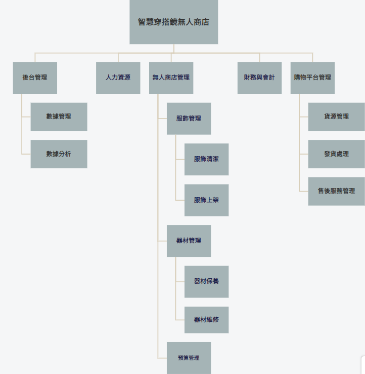
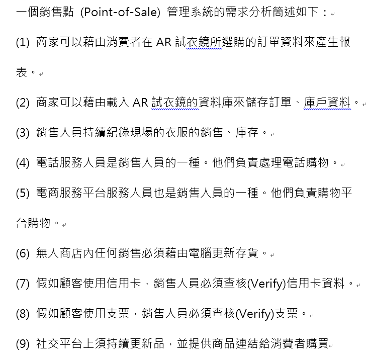
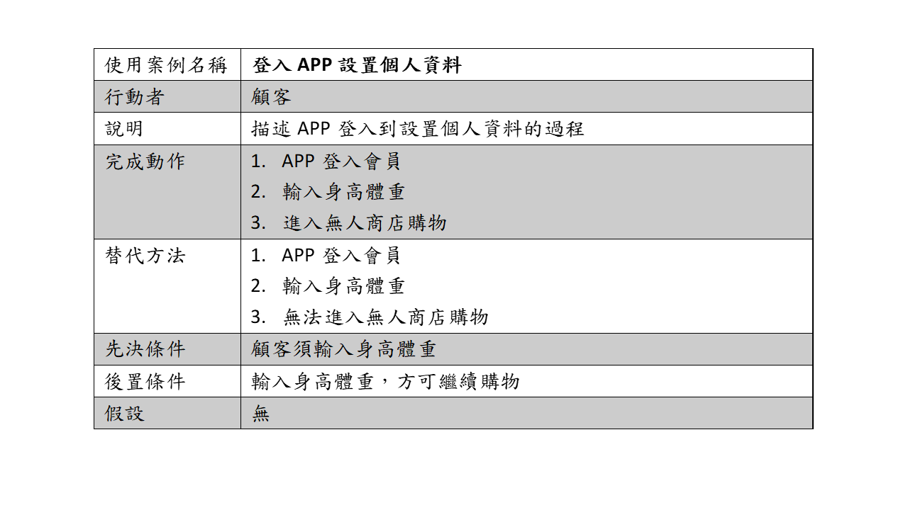
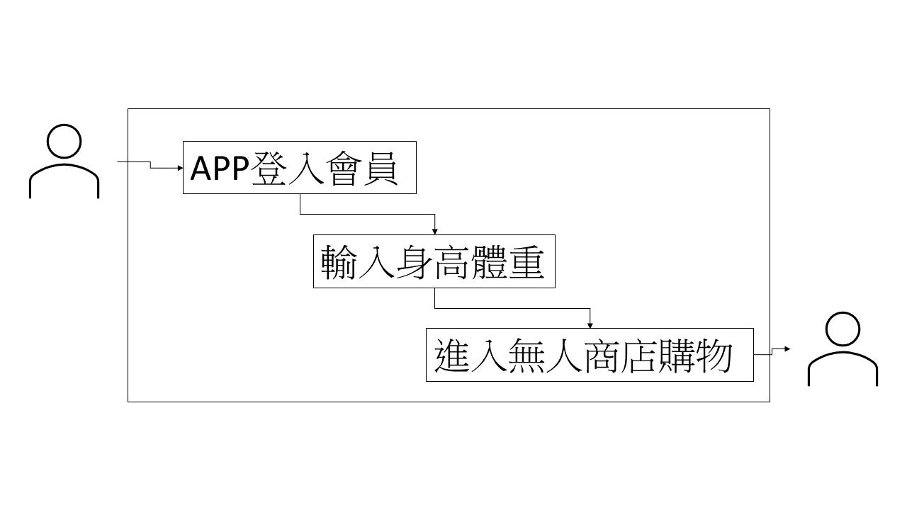
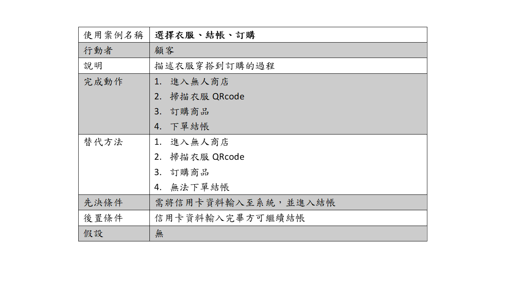
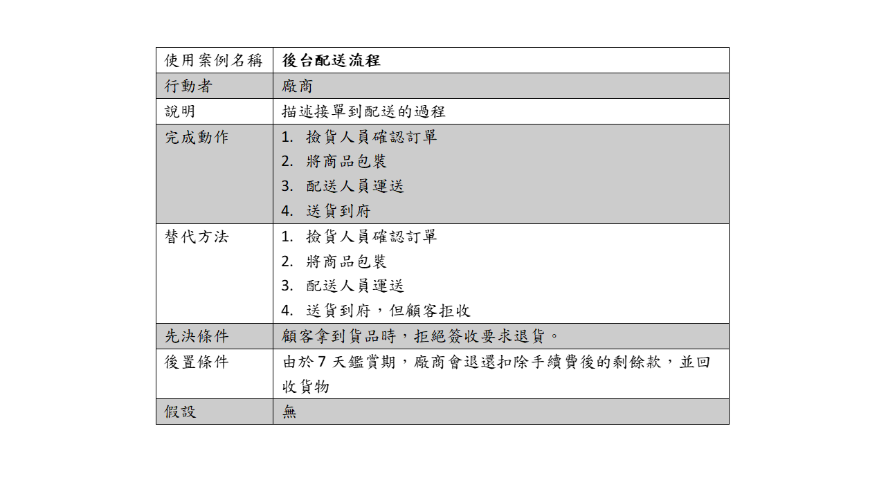

# 功能性需求及非功能性需求
## 功能性需求：
### 提供模擬試衣功能、即時購物系統、服飾模型輸入及輸出顯示、定時芳香除臭功能

## 非功能性需求：
### 效能：結合5G網路，使系統能夠即時傳輸大量的運算結果，讓使用者能夠有流暢的體驗

## 使用性：
設計人性化界面，讓適用者能夠直覺的操作，以降低學習的時間

## 維護性：
增強資安，架設本地伺服器

## 反應時間：
使用者觸發衣服樣式時在3秒內作出反應

## 可靠度：
如果直接用鏡頭判斷消費者的體態，那顯示在螢幕上的衣服可能會有所落差，如果我們採用會員制，讓消費者在自己的帳號上面輸入自己的體態資訊，然後在試衣鏡上掃碼登入，這樣再結合鏡頭的辨識，就更能給消費者更加精準的服飾大小

## 功能分解圖-FDD:

## 銷售點管理系統：

## 使用案例說明1
### 登入APP設置個人資料：

## 使用案例說明2
### 選擇衣服、結帳、訂購：

## 使用案例說明3
### 後台配送流程：

---
### Figma使用案例動態模擬畫面

[APP Figma](https://www.figma.com/proto/FehqUfoSvdHeeSbOjofYdE/Untitled?node-id=11%3A187&scaling=scale-down&page-id=0%3A1&starting-point-node-id=11%3A187)

