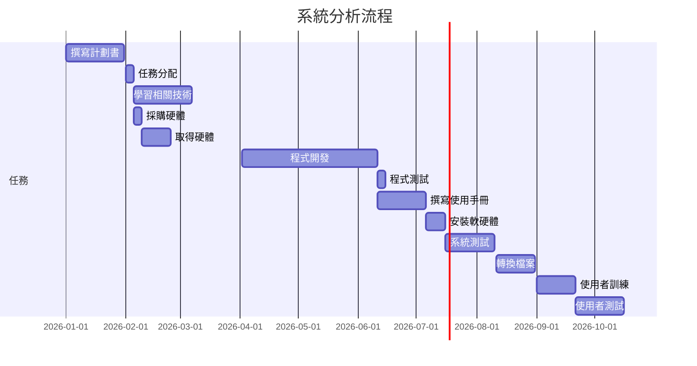
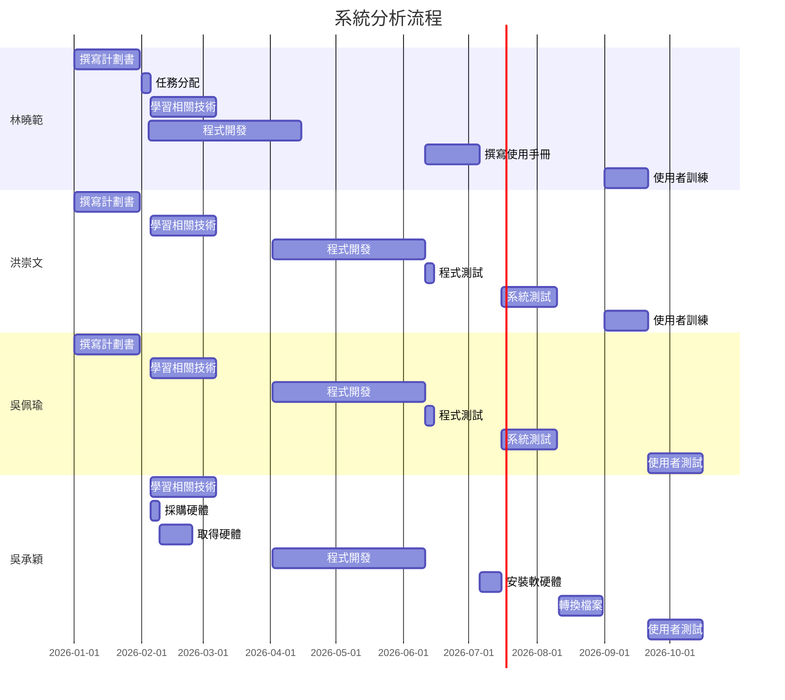
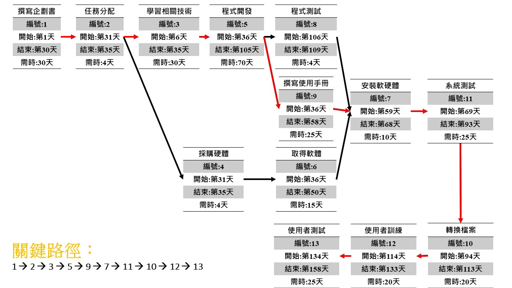
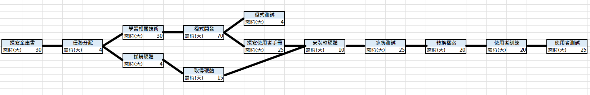
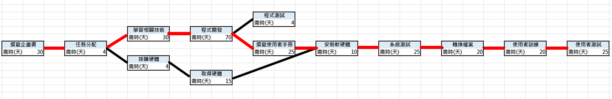

# 專題題目: 智慧穿衣境
### 內容:
###### 描述內容
---

### 組長: 林曉範
#### 組員: 吳佩瑜、洪崇文、吳承穎

---
## 組員任務分配 : 
| 姓名 | 負責任務 |
| ---- | ---- |
| 林曉範 | 撰寫計劃書、任務分配、學習相關技術、程式開發、撰寫使用手冊、使用者訓練 |
| 吳佩瑜 | 撰寫計劃書、學習相關技術、程式開發、程式測試、系統測試、使用者測試 |
| 洪崇文 | 撰寫計劃書、學習相關技術、程式開發、程式測試、系統測試、使用者訓練 |
| 吳承穎 | 學習相關技術、採購硬體、取得硬體、程式開發、安裝軟硬體、轉換檔案、使用者測試 |

---
## 鏡子 Project 1005
|序 | 任務 | 需時(天) |  前置任務  |
|:--:|:---:|:-----:|:-----:|
| 1  | 撰寫企畫書 | 30 | - |
| 2  | 任務分配 | 4 | 1 |   
| 3  | 學習相關技術 | 60 | 2 |
| 4  | 採購硬體 | 15 | 2 |
| 5  | 程式開發 | 70 | 3 |
| 6  | 取得硬體 | 15 | 4 |
| 7  | 程式測試 | 30 | 5 |
| 8  | 撰寫使用手冊 | 25 | 5 |
| 9  | 安裝軟硬體 | 10 | 6,7,8 |
| 10 | 系統測試 | 25 | 9 |
| 11 | 轉換檔案 | 20 | 10 |
| 12 | 使用者訓練 | 20 | 11 |
| 13 | 使用者測試 | 25 | 12 |

---

## 甘特圖:

## PERT圖:

## CPM圖:

# 功能性需求及非功能性需求
## 功能性需求：
### 提供模擬試衣功能、即時購物系統、服飾模型輸入及輸出顯示、定時芳香除臭功能

## 非功能性需求：
### 效能：結合5G網路，使系統能夠即時傳輸大量的運算結果，讓使用者能夠有流暢的體驗

## 使用性：
設計人性化界面，讓適用者能夠直覺的操作，以降低學習的時間

## 維護性：
增強資安，架設本地伺服器

## 反應時間：
使用者觸法衣服樣式時在3秒內作出反應

## 可靠度：
如果直接用鏡頭判斷消費者的體態，那顯示在螢幕上的衣服可能會有所落差，如果我們採用會員制，讓消費者在自己的帳號上面輸入自己的體態資訊，然後在試衣鏡上掃碼登入，這樣再結合鏡頭的辨識，就更能給消費者更加精準的服飾大小
