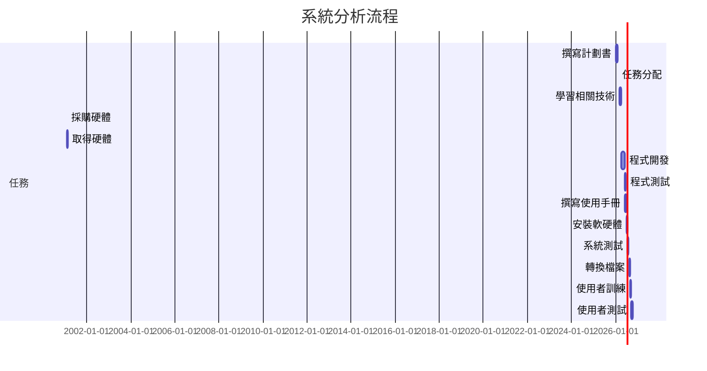

# 專題題目: 智慧穿衣境
### 內容:
###### 描述內容
---

### 組長: 林曉範
#### 組員: 吳佩瑜、洪崇文、吳承穎

---
## 組員任務分配 : 
| 姓名 | 負責任務 |
| ---- | ---- |
| 林曉範 | xxx |
| 吳佩瑜 | xxx |
| 洪崇文 | xxx |
| 吳承穎 | xxx |

---
## 鏡子 Project 1005
|序 | 任務 | 需時(天) |  前置任務  |
|:--:|:---:|:-----:|:-----:|
| 1  | 撰寫企畫書 | 30 | - |
| 2  | 任務分配 | 4 | 1 |   
| 3  | 學習相關技術 | 60 | 2 |
| 4  | 採購硬體 | 15 | 2 |
| 5  | 程式開發 | 70 | 3 |
| 6  | 取得硬體 | 15 | 4 |
| 7  | 程式測試 | 30 | 5 |
| 8  | 撰寫使用手冊 | 25 | 5 |
| 9  | 安裝軟硬體 | 10 | 6,7,8 |
| 10 | 系統測試 | 25 | 9 |
| 11 | 轉換檔案 | 20 | 10 |
| 12 | 使用者訓練 | 20 | 11 |
| 13 | 使用者測試 | 25 | 12 |

---

## 甘特圖:

## PERT/CPM圖:
